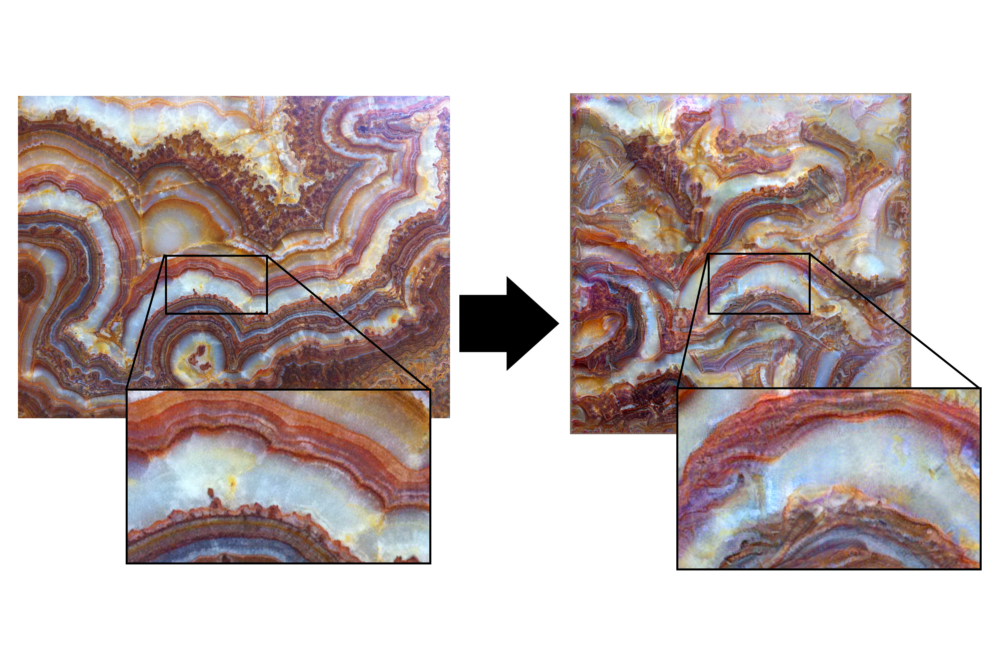

# Subjective functions
## Multi-scale neural texture synthesis

By using a Gaussian pyramid and extracting Gatys-style "style" descriptors
using the Gramian of intermediate VGG layers for each spatial scale in the
pyramid, we can create much higher-resolution images, with structure at
multiple image scales, not necessarily aligned with the receptive field of the
layers of Gatys.



More information at [the research page](http://wxs.ca/research/multiscale-neural-synthesis/).

This code will hopefully, one day, improve. I've rushed it online pre-publication for a [workshop at InterAccess](http://interaccess.org/workshop/2017/jul/objective-functions-creating-images-neural-networks).
## Quickstart

Install the pre-requisites

    pip3 install -r requirements.txt

Run locally (this will likely be very slow as it runs on your GPU)

    python3 synthesize.py -s bark.jpg

Look for output files inside the "outputs" directory that will be created by this command.

### Run in FloydHub

To quickly run this on a GPU if you have an account with FloydHub you can run;

    floyd init subjective-functions

then try:

    floyd run --gpu "python3 synthesize.py -s bark.jpg --data-dir /vgg_weights --output-dir /output" --data wxswxs/vgg-weights/1:vgg_weights

## Configuration

Most immediately useful flags:

    -s - Path to source texture image
    --output-width, --output-height, output dimensions in pixels


To see all the other flags run

    python3 synthesize.py -h

which, as of this writing, outputs:

```
usage: synthesize.py [-h] [--output-width OUTPUT_WIDTH]
                     [--output-height OUTPUT_HEIGHT] [--octaves OCTAVES]
                     [--layers LAYERS [LAYERS ...]] [--max-iter MAX_ITER]
                     [--output-prefix OUTPUT_PREFIX] [--save-every SAVE_EVERY]
                     [--source-scale SOURCE_SCALE]
                     [--source-width SOURCE_WIDTH]
                     [--padding-mode {valid,same}] [--join-mode {average,max}]
                     [--count COUNT] [--mul MUL] [--if-weight IF_WEIGHT]
                     [--if-shift IF_SHIFT] [--if-order IF_ORDER]
                     [--seed {random,symmetric}] [--data-dir DATA_DIR]
                     [--output-dir OUTPUT_DIR] [--tol TOL] --source SOURCE
                     [SOURCE ...]

Synthesize image from texture

optional arguments:
  -h, --help            show this help message and exit
  --output-width OUTPUT_WIDTH, -ow OUTPUT_WIDTH
                        Pixel width of generated image (default: 512)
  --output-height OUTPUT_HEIGHT, -oh OUTPUT_HEIGHT
                        Pixel height of generated image. If not specified,
                        equal to output-width. (default: None)
  --octaves OCTAVES, -o OCTAVES
                        Number of octaves (where 1 means "Consider only 1
                        scale") (default: 4)
  --layers LAYERS [LAYERS ...], -l LAYERS [LAYERS ...]
                        Which layers to match gram matrices on (default: [2,
                        7])
  --max-iter MAX_ITER, -m MAX_ITER
                        Maximum iterations for the L-BFGS-B optimizer
                        (default: 500)
  --output-prefix OUTPUT_PREFIX, -op OUTPUT_PREFIX
                        Prefix to append to output directory (default: out)
  --save-every SAVE_EVERY, -n SAVE_EVERY
                        Save an in-progress optimization image every
                        SAVE_EVERY iterations (default: 10)
  --source-scale SOURCE_SCALE, -ss SOURCE_SCALE
                        How much to scale the source image by (default: None)
  --source-width SOURCE_WIDTH, -sw SOURCE_WIDTH
                        Scale source to this width. Mutually exclusive with
                        source-scale (default: None)
  --padding-mode {valid,same}, -p {valid,same}
                        What boundary condition to use for convolutions
                        (default: valid)
  --join-mode {average,max}, -j {average,max}
                        How to combine gram matrices when multiple sources
                        given (default: average)
  --count COUNT, -c COUNT
                        How many images to generate simultaneously (default:
                        1)
  --mul MUL             Multiply target grams by this amount (default: 1.0)
  --if-weight IF_WEIGHT
                        Inter-frame loss weight (default: 1.0)
  --if-shift IF_SHIFT   How many pixel-shift should inter-frame loss
                        approximate? (default: 5.0)
  --if-order IF_ORDER   How many frames should we 'tie' together? (default:
                        2.0)
  --seed {random,symmetric}
                        How to seed the optimization (default: random)
  --data-dir DATA_DIR, -d DATA_DIR
                        Where to find the VGG weight files (default:
                        model_data)
  --output-dir OUTPUT_DIR
                        Where to save the generated outputs (default: outputs)
  --tol TOL             Gradient scale at which to terminate optimization
                        (default: 1e-09)
  --source SOURCE [SOURCE ...], -s SOURCE [SOURCE ...]
                        List of file to use as source textures (default: None)
```


